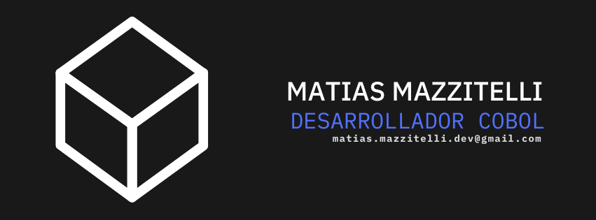

  
  
 # 👋 Hola! mi nombre es **Matías** y soy Desarrolador de Software

  

  
  ## Acerca de mi 🔍

  

    Soy un desarrollador de software con mas de 2 años de experiencia, en continua formación y siempre en busca de nuevas oportunidades, lo que me ha permitido adquirir sólidos conocimientos en programación, bases de datos y metodologías ágiles. Actualmente estoy cursando la Tecnicatura en Desarrollo de Software y realizando una formacion como Desarrollador COBOL | CICS | DB2 en la Universidad de Buenos Aires con los expertos de CODEKI.
  

  

    He participado como Java back-end developer en proyectos colaborativos que replican entornos reales, donde junto a otros desarrolladores hemos desarrollado aplicaciones web desde cero, trabajando en equipo para cumplir plazos ajustados y entregar productos funcionales (MVP).
  

  
  ## Tecnologías 🔥

### [ Mainframe ]

 

### [ Back end ] [ Java ]

 

 

 

### [ Front end ] [ JavaScript ]

 

### [ Herramientas ] 

## Proyectos 🚀

  <table border="0" cellpadding="15">
    <tr>
    <td>
        

          <h3>Formación CODEKI | UBA</h3>
          
            
          
        

      </td>
      <td> </td>
      <td>
        

          <h3>Nativo</h3>
          
            
          
          
        

      </td>
      <td> </td>
      <td>
        

          <h3>ECO Sistema</h3>
          
            
          
        

      </td>
    </tr>
  </table>

## Contacto 🤝
  

    
    
    
  

### Eres el visitante 👇❤️
  

