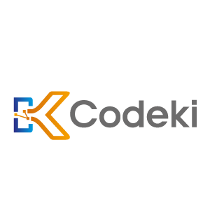
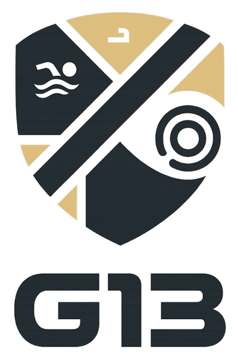

  
  
  ### 👋 ¡Hola! Soy **Matías** | Hello there! I'm **Matías**  
  
🖥️ Desarrollador de Software | Software Developer
  
  
🚀 <strong>Especializado en Mainframe: COBOL | JCL | DB2 | CICS</strong>

  

  
  

 

## 🔍 Acerca de mí | About Me

  

    Desarrollador con +3 años de experiencia en programación, bases de datos y metodologías ágiles. 
    <strong>Especializado en desarrollo Mainframe con COBOL, JCL, DB2 y CICS</strong>. 
    He completado exitosamente mi formación en CODEKI | UBA, trabajando con Mainframes reales 24/7.
  

  

    Actualmente curso la Tecnicatura en Desarrollo de Software, donde he profundizado en análisis y diseño (UML, requerimientos), 
    desarrollo con .NET/C# y Kotlin/Android Studio, testing (unitarias, integración, Selenium, NUnit) y proyectos completos.
  

  

    Como desarrollador Java Backend, participé en proyectos colaborativos que simulan entornos reales, 
    construyendo aplicaciones web desde cero bajo plazos ajustados (MVP). Esta experiencia me dio habilidades transferibles al mundo Mainframe.
  

  

  

    I'm a developer with 3+ years of experience in programming, databases, and agile methodologies. 
    <strong>Specialized in Mainframe development with COBOL, JCL, DB2 and CICS</strong>. 
    I have successfully completed my training at CODEKI | UBA, working with real 24/7 Mainframes.
  

  

    Currently pursuing a Software Development degree, where I've deepened my knowledge in analysis and design (UML, requirements), 
    development with .NET/C# and Kotlin/Android Studio, testing (unit, integration, Selenium, NUnit) and complete projects.
  

  

    As a Java Backend developer, I contributed to collaborative projects simulating real work environments, 
    building web apps from scratch under tight deadlines (MVPs). This gave me transferable skills for Mainframe development.
  

 

  ## 🔥 Tecnologías | Technologies

  <h4><strong>[ Mainframe ] [ COBOL ]</strong></h4>

 

  <h4><strong>[ Back end ] [ Java ]</strong></h4>

 

 
 

<h4><strong>[ Desarrollo Móvil & Desktop ]</strong></h4>

  
  
  
  

<h4><strong>[ Front end ] [ JavaScript ]</strong></h4>
 

<h4><strong>[ Testing ]</strong></h4>

  
  
  
  

  <h4><strong>[ Herramientas ] | [ Tools ]</strong></h4>

  
  
  
  

 

## 🚀 Proyectos Destacados | Featured Projects
  
<table>
  <tr>
    <td align="center" width="33%">
      <h3 style="text-align: center;">CODEKI | UBA</h3>
      
      
Mainframe training

      
COBOL | CICS | DB2

      
    </td>
    <td align="center" width="33%">
      <h3 style="text-align: center;">Nativo</h3>
      
      
Rural Banking app

      
Java | Spring backend

      
      
    </td>
    <td align="center" width="33%">
      <h3 style="text-align: center;">ECO Sistema</h3>
      
      
Environmental app

      
Java | Spring backend

      
    </td>
  </tr>
</table>

 

## 📚 Proyectos Universitarios | Academic Projects

<table>
  <tr>
    <td align="center" width="33%">
      <h3 style="text-align: center;">Clínica SePrise App</h3>
      
      
Healthcare clinic management app

      
C# | .Net Desktop

      
    </td>
    <td align="center" width="33%">
      <h3 style="text-align: center;">Club Deportivo (Mobile)</h3>
      
      
Sport Club management app

      
Kotlin | Android Studio

      
    </td>
    <td align="center" width="33%">
      <h3 style="text-align: center;">Club Deportivo (Desktop)</h3>
      
      
Sport Club management app

      
C# | .Net Desktop

      
    </td>
  </tr>
</table>

 

<h2><strong>🤝 Contacto | Contact</strong></h2>

  <h3><strong>❤️ Gracias por visitar | Thanks for stopping by!</strong></h3>

  
<em>Actualmente enfocado en oportunidades como Desarrollador Mainframe | Currently focused on Mainframe Developer opportunities</em>

