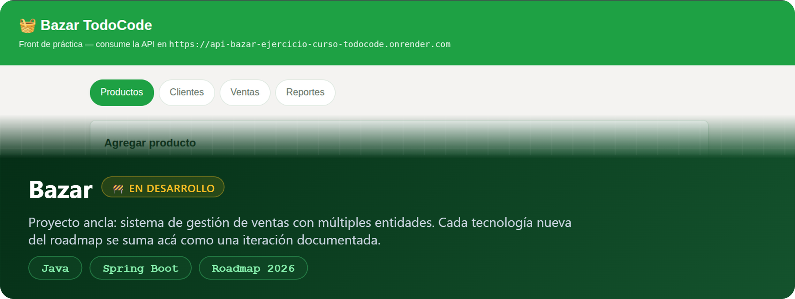
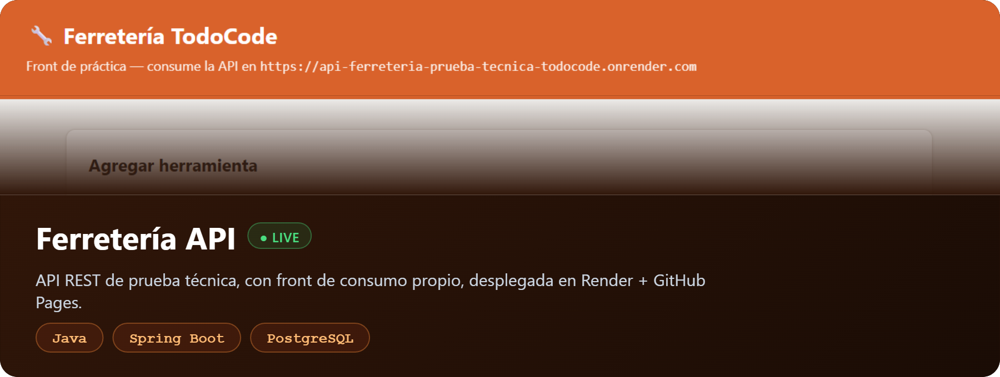
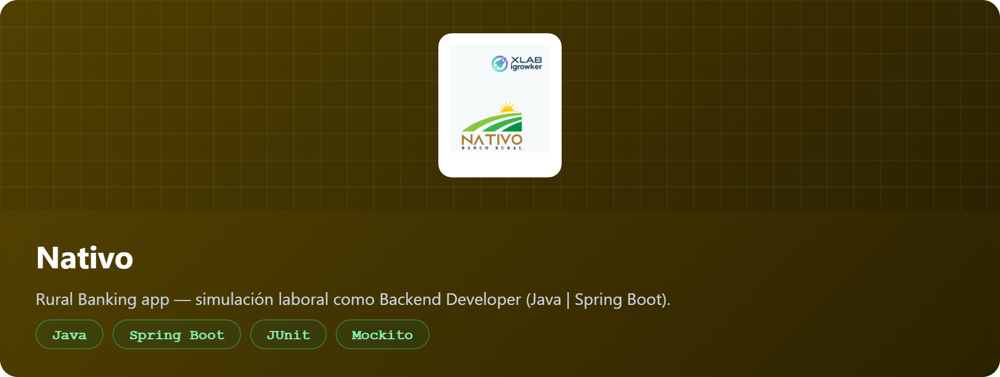
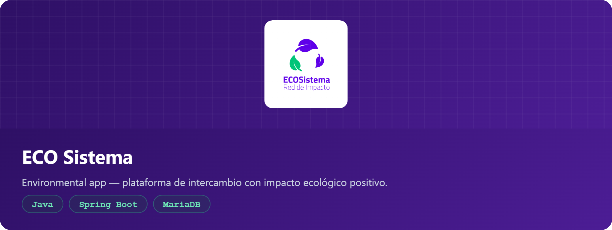
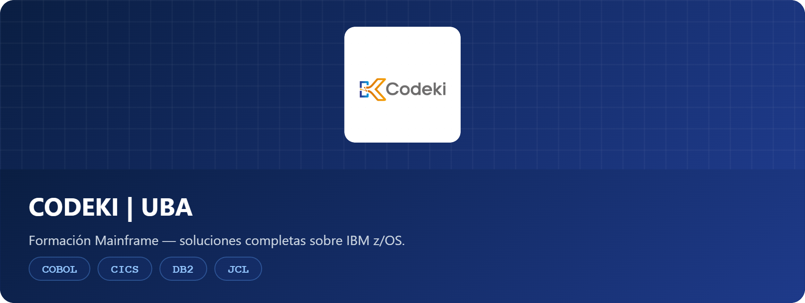
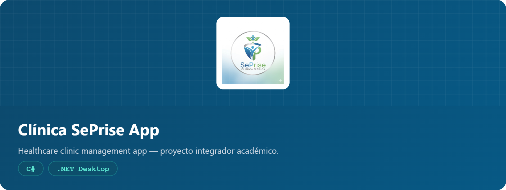
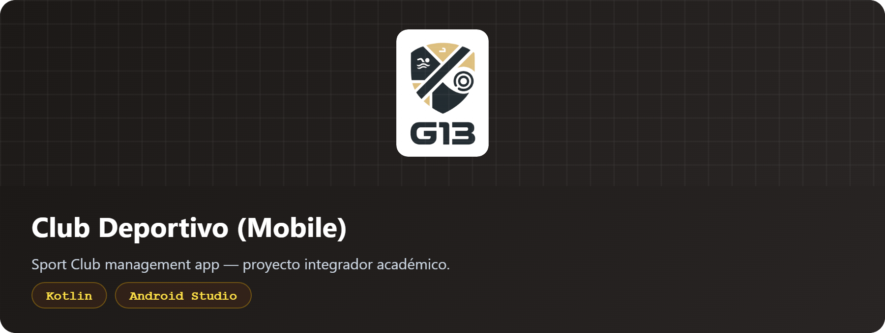
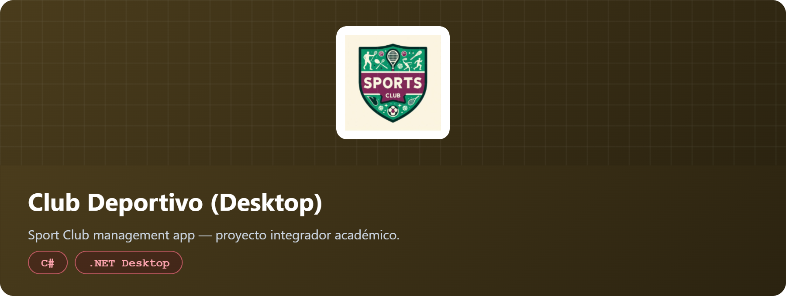

  

    &lt;/&gt; MDEV
  

  

  ### 👋 ¡Hola! Soy **Matías** | Hello there! I'm **Matías**

  

  
  
  

 

## 🔍 Acerca de mí | About Me

  

    Desarrollador backend enfocado en <strong>Java + Spring Boot</strong>. Estoy terminando la Tecnicatura en
    Desarrollo de Software (5 materias restantes) y sumando, en paralelo, un roadmap propio de especialización Backend con Java (programación funcional, microservicios, Spring Security, testing, Spring AI, y mucho más!).
  

  

    Como diferencial, tengo formación y práctica real en <strong>Mainframe IBM</strong> (COBOL, JCL, DB2, CICS),
    completada en CODEKI | UBA trabajando contra mainframes reales 24/7. Es una combinación poco común que me permite entender sistemas backend tanto modernos como legacy/transaccionales.
  

  

    Todavía no tengo experiencia laboral formal, así que estoy construyendo evidencia práctica: proyectos propios
    documentados de punta a punta (diseño, código, tests, deploy) en vez de solo ejercicios de curso.
  

  

  

    Backend developer focused on <strong>Java + Spring Boot</strong>. I'm finishing my Software Development degree
    (5 courses left) while following my own Backend specialization roadmap with Java (functional programming,
    microservices, Spring Security, testing, Spring AI, and much more!).
  

  

    As a differentiator, I have real training and hands-on practice in <strong>IBM Mainframe</strong> (COBOL, JCL,
    DB2, CICS), completed at CODEKI | UBA working against real 24/7 mainframes. It's an uncommon combination that
    helps me understand both modern and legacy/transactional backend systems.
  

  

    I don't have formal work experience yet, so I'm building practical evidence instead: fully documented personal
    projects (design, code, tests, deploy) rather than just course exercises.
  

 

  ## 🔥 Stack

  <h4><strong>[ Backend ] [ Java ]</strong></h4>

 

  <h4><strong>[ Mainframe ] [ IBM ]</strong></h4>

  <h4><strong>[ Herramientas ]</strong></h4>

 

<strong>🧩 Otras tecnologías (facultad) | Other technologies (coursework)</strong>

 

 

 

 

## 🚀 Proyecto Ancla | Anchor Project

> Voy a ir creciendo este proyecto a medida que avanzo en mi roadmap (funcional → microservicios → Spring Security → testing → Spring AI), documentando cada etapa.

Sistema de gestión de venta más complejo (múltiples entidades, lógica de negocio de ventas/stock) que ferretería, lo que me da la posibilidad de expandirlo con tecnologías más desafiantes. Va a ser mi proyecto de referencia: cada tecnología nueva del roadmap se incorpora acá como una iteración documentada, en vez de quedar dispersa en mini-proyectos sueltos.
Backend corriendo en local por ahora — el deploy (Render + PostgreSQL) es el próximo paso.

 

## 💼 Proyectos Destacados | Featured Projects

 

 

 

## 🖥️ Mainframe

 

<strong>📚 Proyectos Universitarios | Academic Projects</strong> (requeridos por la carrera)

 

 

 

 

## 📊 Actividad

  

<h2><strong>🤝 Contacto | Contact</strong></h2>

<em>🔎 Buscando oportunidades como Backend Developer (Java) | COBOL Developer — primer empleo formal en desarrollo.</em>

<em>🔎 Looking for Backend Developer (Java) | COBOL Developer opportunities — first formal role in software development.</em>

