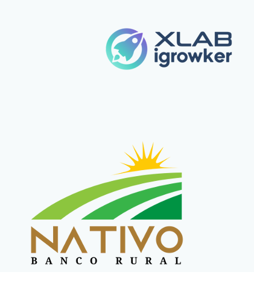
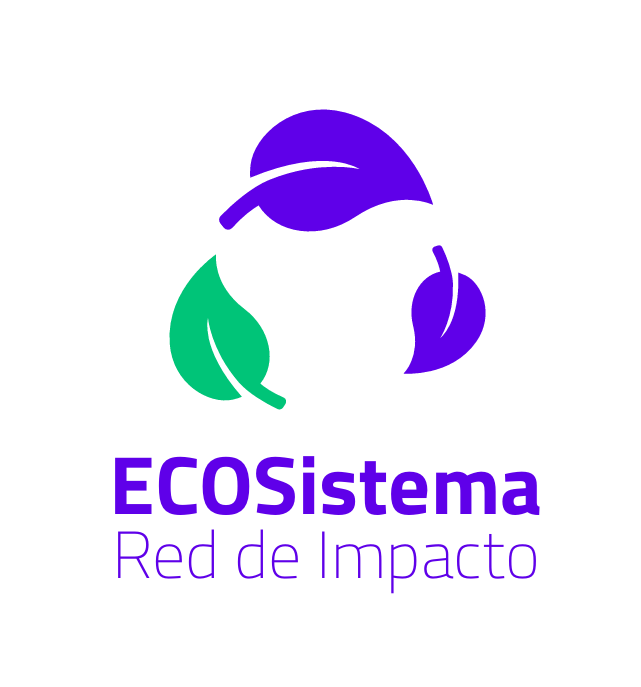

  
  
  <h1>Hi there! 👋 I'm Matías, a Software Developer ⚡</h1>

---

## About Me 🔍

I am a Backend-oriented Software Developer with more than 2 years of experience, in continuous training and always looking for new opportunities, which has allowed me to acquire solid knowledge in programming, databases, and agile methodologies. Currently, I am studying the Technician in Software Development and training as a COBOL Developer | CICS | DB2.

I have participated in collaborative projects that replicate real environments, where I have collaborated with other developers in creating web applications from scratch, working as a team to meet tight deadlines and deliver functional products (MVP).

---

## Stack 🔥

### Backend

### Databases

### Frontend

### Testing

### Version Control

### Collaboration

---

## Projects 🚀

  ### Nativo Banco Rural
  

    
    

      
      
    

  

  ### ECO Sistema
  

    
    

      
      
    

  

---

## Contact Me 🤝

  
  
  

---

## Total Visitors 👇❤️

  

